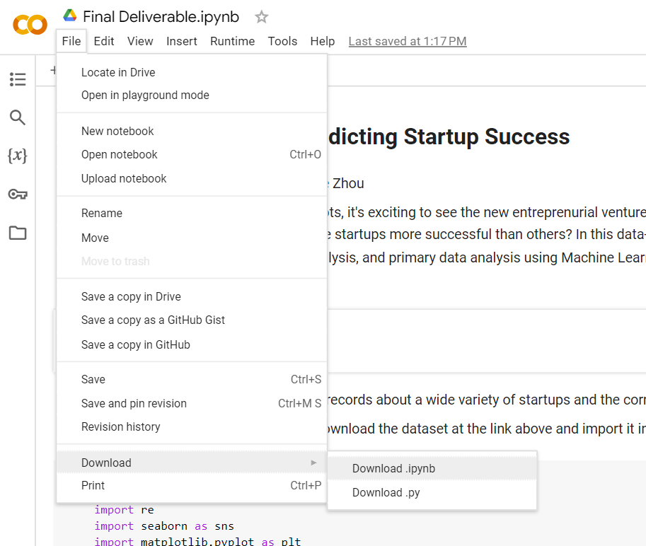
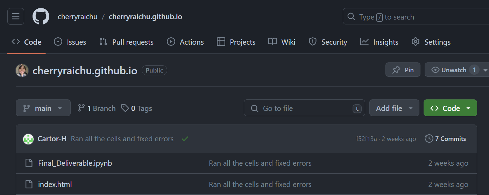
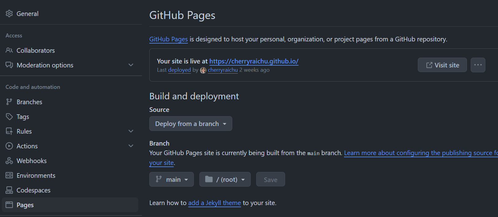
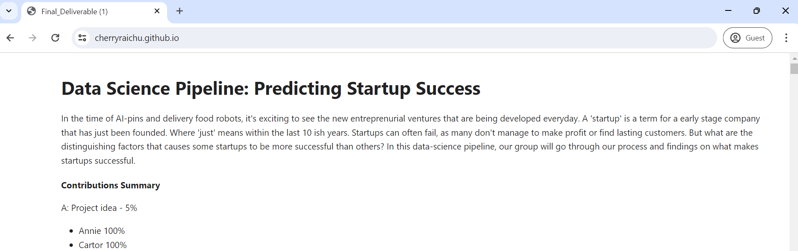

Congratulations on finishing your CMSC320 final project. In this article, we're going to walk you through the very last step of your project...publication to the internet!

GitHub is a free provider of internet hosting for software development and version control. They provide a service called <a href="https://pages.github.com/">Pages</a> that provides website hosting backed by a GitHub-based git repository. We would like you to host your final project on a GitHub Pages project site.

# Tutorial

1. Download your Google Colab file and convert it from a file with a `.ipynb` extention to a `.html` file
    
    * Make sure you download the .ipynb file *after running the code* within your cells so that it contains the output of your code.
    * This  is a online resource that can be used for converting files from .ipynb to .html format

2. Create a Github repository for your project and title it `username.github.io`. 

    * <b>Make sure username is the same as whatever you chose for your global GitHub account.</b>

3. Add the following files to your repository: 
    1. iPython Notebook  -> This should be your project Colab file with the `.ipynb` file extention
    2. HTML -> This should be named `index.html` and is the converted version of your Colab file

4. You should now have a github repository that looks like the following:

    

4. Deploy your website by navigating to Pages in the settings of your project repository and checking off the following settings:
    1. Source: Deploy from a branch
    2. Branch: main

5. Your settings should look like the following if you've successfully deployed your site:
    
    * Your site might not immediately be deployed. Allow for some time for your repository changes to sync.

6. Check if your website works and is formatted correctly by visiting `username.github.io` in your internet browser
    
    * The deliverable to the CMSC320 staff will then be the single URL `username.github.io` pointing to this publicly-hosted GitHub Pages-backed website.

    
# Troubleshooting and FAQs
